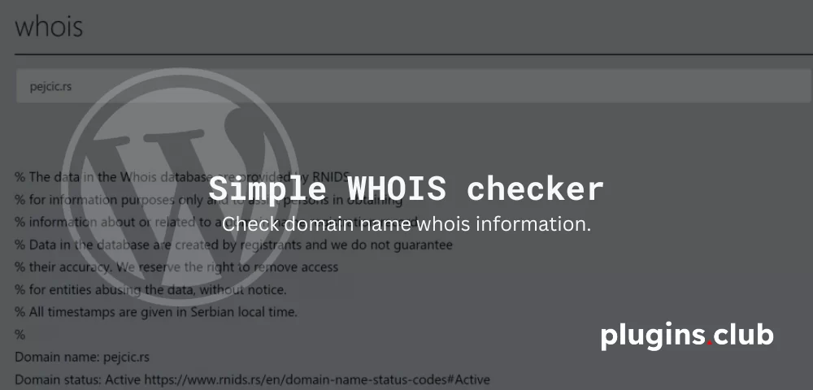
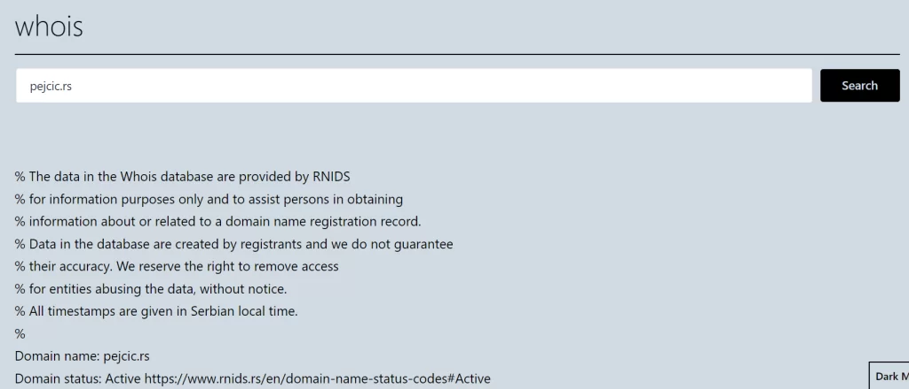

# Simple-WHOIS-Checker

Use the `[whois]` shortcode in the content of your pages and posts to display the Whois form. When the form is submitted, the Whois information for the entered domain will be displayed on the same page.

Note that this plugin requires the [whois command](https://www.commandlinux.com/man-page/man1/whois.1.html) to be available on the server and that the website has **permission to execute shell commands**.

